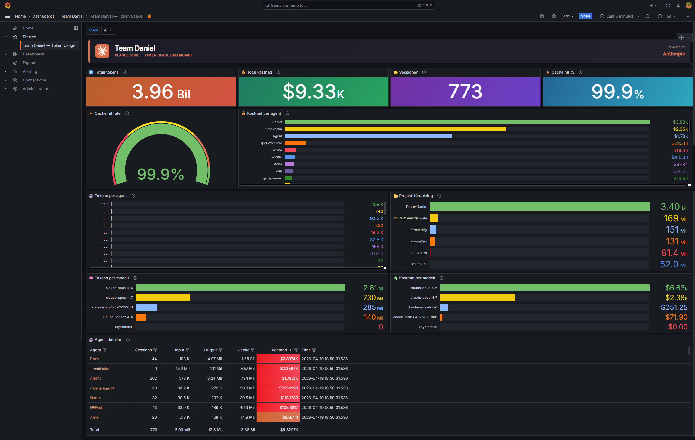

# Claude Code Telemetry

> Local token-usage dashboard for Claude Code — no API key required.

[](https://python.org)
[](https://docker.com)
[](LICENSE)
[](https://claude.ai/code)

```
╔═══════════════════════════════════════════╗
║  Track your Claude Code token usage       ║
║  locally · privately · for free           ║
╚═══════════════════════════════════════════╝
```



---

## What is this?

`claude-code-telemetry` reads Claude Code's local JSONL session files from `~/.claude/` and exposes per-agent token consumption as a Grafana dashboard. It works with a Claude Max subscription — no API key, no external service, no data leaving your machine. The parser is strictly privacy-first: it reads only `usage` metadata (token counts) and never touches message content.

---

## Features

- Per-agent token breakdown: input, output, cache write, cache read
- Estimated cost per agent based on Claude Sonnet 4.6 pricing
- Session count and last-seen timestamp per agent
- Project-level attribution derived from session file paths
- Fully local stack: Prometheus + Grafana run in Docker
- Grafana dashboard auto-provisioned on first start
- Portable dashboard JSON export for sharing or backup
- No API key or Anthropic account access required

---

## How It Looks


*Token usage across all agents, with cost estimates and cache hit rate.*

---

## Requirements

- Python 3.8+
- Docker + Docker Compose
- Claude Code installed with local session files present in `~/.claude/`

---

## Quick Start

Get up and running in under two minutes — no account setup, no cloud services. Just clone, start the stack, and open Grafana.

**1. Clone the repository**

```bash
git clone https://github.com/your-username/claude-code-telemetry.git
cd claude-code-telemetry
```

**2. Create a virtual environment and install dependencies**

```bash
python -m venv .venv

# macOS / Linux
source .venv/bin/activate

# Windows
.venv\Scripts\activate

pip install -r requirements.txt
```

**3. Start the Docker stack**

```bash
docker compose up -d
```

Wait about 30 seconds for all services to become healthy:

```bash
docker compose ps
```

**4. Start the metrics exporter**

```bash
python run_exporter.py
```

The exporter scans `~/.claude/projects/` and serves metrics on port 8000. Prometheus scrapes it every 60 seconds via `host.docker.internal:8000`. Keep the terminal open, or run it in the background:

```bash
# macOS / Linux
nohup python run_exporter.py &

# Windows PowerShell
Start-Process python -ArgumentList "run_exporter.py" -WindowStyle Hidden
```

**Open Grafana:** [http://localhost:3000](http://localhost:3000) — username `admin`, password `admin`

> The Grafana port defaults to `3000` (mapped from container port 3000). If port 3000 is already in use on your machine, change the host port in `docker-compose.yml` (e.g., `"3002:3000"`).

---

## How It Works

```
~/.claude/projects/
        │
        ▼
claude_session_parser.py   — reads JSONL session files, extracts token usage
        │
        ▼
metrics_exporter.py        — serves Prometheus metrics on port 8000
        │
        ▼
Prometheus (port 9090)     — scrapes metrics every 60 seconds
        │
        ▼
Grafana (port 3000)        — visualises token usage per agent
```

**`claude_session_parser.py`** scans `~/.claude/projects/` recursively. Root-level session files are attributed to the primary user (`Daniel`). Files under `subagents/` are attributed by name: the first word of the agent's `description` field in the `.meta.json` sidecar is used as the agent name (e.g., `"Wilma removes..."` → agent `Wilma`). If no description is present, the `agentType` field is used as a fallback.

**`metrics_exporter.py`** instantiates the parser, aggregates results by agent, and exposes them as Prometheus Gauges over HTTP. It re-scans on a configurable interval (default: 60 seconds).

**Prometheus** is configured in `prometheus.yml` to scrape the exporter at `host.docker.internal:8000`. It retains 30 days of data.

**Grafana** is auto-provisioned with a Prometheus datasource and the token-usage dashboard. No manual setup is needed.

---

## Metrics

| Metric | Labels | Description |
|---|---|---|
| `claude_tokens_total` | `agent`, `project`, `type`, `model` | Accumulated token count per agent, project, token type (`input` / `output` / `cache_write` / `cache_read`) and model |
| `claude_cost_usd_total` | `agent`, `project`, `model` | Estimated total cost in USD per agent, project and model |
| `claude_sessions_total` | `agent`, `project`, `model` | Number of sessions parsed per agent, project and model |

---

## Dashboard Panels

| Panel | Type | Description |
|---|---|---|
| Total tokens | Stat | Sum of all tokens across all agents |
| Total cost | Stat | Estimated total cost in USD |
| Sessions | Stat | Total session count |
| Cache hit % | Stat | Percentage of tokens served from Anthropic prompt cache |
| Cache hit rate | Gauge | Visual cache hit rate indicator |
| Cost per agent | Bar chart | Estimated USD cost broken down by agent |
| Tokens per agent | Bar chart | Token volume broken down by agent |
| Project distribution | Bar chart | Token volume broken down by project (log scale) |
| Tokens per model | Bar chart | Total token usage broken down by Claude model (Opus / Sonnet / Haiku) |
| Cost per model | Bar chart | Estimated USD cost broken down by Claude model |
| Agent details | Table | Full breakdown: input, output, cache, cost, sessions per agent |

---

## Configuration

`metrics_exporter.py` (and `run_exporter.py`) accept the following arguments:

| Flag | Default | Description |
|---|---|---|
| `--port` | `8000` | HTTP port for the Prometheus scrape endpoint |
| `--interval` | `60` | Seconds between re-scans of `~/.claude/` |
| `--claude-dir` | `~/.claude/` | Path to the Claude configuration directory |

Example:

```bash
python run_exporter.py --port 8001 --interval 30 --claude-dir /custom/path/.claude
```

---

## Export Dashboard

To save a portable copy of the dashboard (useful for sharing or backup):

```bash
python export_dashboard.py
```

This creates `team-tokens-export.json` with datasource references normalised to variables so it can be imported into any Grafana instance.

**Options:**

```bash
python export_dashboard.py --output my-dashboard.json
python export_dashboard.py --url http://other-server:3000 --user admin --password secret
```

**Import:** Grafana → Dashboards → Import → Upload JSON file.

---

## Pricing Model

Cost estimates use per-model list prices. The model is detected from each session's JSONL data (`message.model` field). If no model is found, Sonnet 4.6 prices are used as fallback.

| Model | Input | Output | Cache write | Cache read |
|---|---|---|---|---|
| claude-opus-4-7 | $15.00 / 1M | $75.00 / 1M | $18.75 / 1M | $1.50 / 1M |
| claude-opus-4-6 | $15.00 / 1M | $75.00 / 1M | $18.75 / 1M | $1.50 / 1M |
| claude-sonnet-4-6 | $3.00 / 1M | $15.00 / 1M | $3.75 / 1M | $0.30 / 1M |
| claude-sonnet-4-5 | $3.00 / 1M | $15.00 / 1M | $3.75 / 1M | $0.30 / 1M |
| claude-haiku-4-5 | $0.80 / 1M | $4.00 / 1M | $1.00 / 1M | $0.08 / 1M |
| default (fallback) | $3.00 / 1M | $15.00 / 1M | $3.75 / 1M | $0.30 / 1M |

Prices change over time. For current rates, see the [Anthropic pricing page](https://www.anthropic.com/pricing). To update, edit the `PRICING` dict at the top of `claude_session_parser.py`.

---

## Troubleshooting

**No metrics appear in Grafana**

1. Verify the exporter is running and serving data:
   ```bash
   curl http://localhost:8000/metrics
   ```
2. Check that Prometheus can reach the target: [http://localhost:9090/targets](http://localhost:9090/targets) — the `claude-session-metrics` job should show `UP`.
3. Check the exporter's terminal output for errors.

**`host.docker.internal` does not resolve (Linux)**

Add the following to the `prometheus` service in `docker-compose.yml`:

```yaml
extra_hosts:
  - "host.docker.internal:host-gateway"
```

Then restart: `docker compose up -d prometheus`.

**Port conflicts**

If port 3000 (Grafana) or 9090 (Prometheus) is already in use, change the host-side port in `docker-compose.yml`:

```yaml
ports:
  - "3002:3000"   # Grafana on 3002
```

**No sessions found**

Confirm that `~/.claude/projects/` exists and contains `.jsonl` files. Claude Code must have been used at least once and must be writing local session data.

---

## Contributing

Pull requests are welcome. Please open an issue first to discuss significant changes. Keep PRs focused — one concern per PR.

---

## License

MIT — see [LICENSE](LICENSE).
